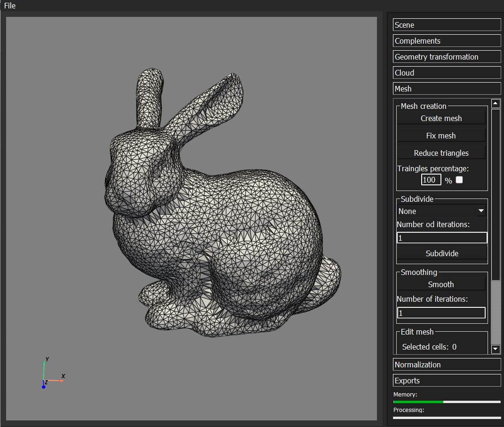
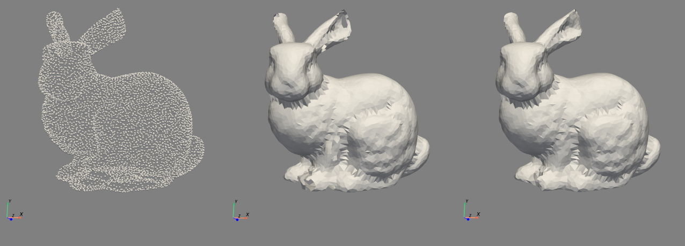

# Processing point clouds into OBJ/STL files. Surface analysis and morphing of objects.

## Table of Contents
- [About the Project](#about-the-project)
- [Getting Started](#getting-started)
  - [Setup your Environment](#setup-your-environment)
- [Main function in the program](#main-function-in-the-program)

## About the Project

[PL]
Projekt ma na celu stworzenie narzędzia do szybkiej identyfikacji wymiarów, kształtów i złożoności obiektów uzyskanych poprzez skanowanie LIDAR. Narzędzie przetworzy chmurę punktów do plików OBJ/STL, wykonując analizę powierzchni i morfizację obiektów. Obsługuje formaty LAZ/LAS, generalizując i segmentując punkty w siatkę, umożliwiając edycję, przemieszczanie, rotację i dodawanie punktów. Dodatkowo pozwala na odczytanie wymiarów płaszczyzn i obiektów na podstawie gotowej siatki.

[EN]
The project aims to create a tool for the rapid identification of dimensions, shapes, and complexity of objects obtained through LIDAR scanning. The tool will process point clouds into OBJ/STL files, perform surface analysis, and morph objects. It supports LAZ/LAS formats, generalizing and segmenting points into a mesh, allowing for editing, moving, rotating, and adding points. Additionally, it enables the reading of dimensions for surfaces and objects based on the generated mesh.

Main GUI in PyQt5

## Getting Started
### Setup your Environment:
Instructions for installing and configuring the project.

1. Install [Anaconda](https://www.anaconda.com/download)
2. Clone repositorium or if you're not into package management, just [download a ZIP](https://github.com/MateuszRumin/PWSZ_3IS_2024_ZPI_P3_G3/archive/refs/heads/main.zip) file.
3. Choose the file named 'morph' and import it into the "Anaconda" environment.
4. If you don't have the "PyCharm" program installed, please download and install it from the official website: [download PyCharm](https://www.jetbrains.com/pycharm/download/download-thanks.html?platform=windows&code=PCC).
5. After installation, run the PyCharm program.
6. Select the Python interpreter as an external library for the "morph".

After completing each of the above steps, you should be able to run the main file "main.py" located in the project.
The program mainly uses the pywt5 open3d, pyvista, and numpy libraries.

## Main function in the program

| Function | Description |
| --- | --- |
| Create mesh | Creating a mesh from a point cloud with appropriate normals |
| Mesh repair | Filling holes in the mesh and modifying it and removing fragments |
| Removing points | Deleting selected points in a point cloud |
| Model transformations | Reposition, scale and rotate the grid and cloud |
| Mesh calculation | Calculating area and volume in a mesh |
| Isolation fragments | Isolation of clouds and mesh fragments. |
| Triangle reduction | Reducing the number of triangles in the mesh |
| Division of triangles | Dividing the mesh into more smaller triangles |
| Mesh smoothing | Smoothing the mesh by softening the edges |

## Solutions Sources:

This project uses ideas and code from the following repositories: 

- [galmetzer/dipole-normal-prop](https://github.com/galmetzer/dipole-normal-prop) -
 **"Orienting Point Clouds with Dipole Propagation"**
  
- [nmwsharp/learned-triangulation](https://github.com/nmwsharp/learned-triangulation?tab=MIT-1-ov-file) -
 **"PointTriNet: Learned Triangulation of 3D Point Sets"**

